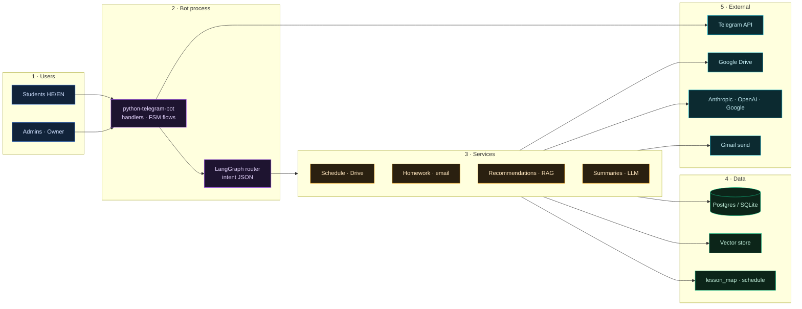
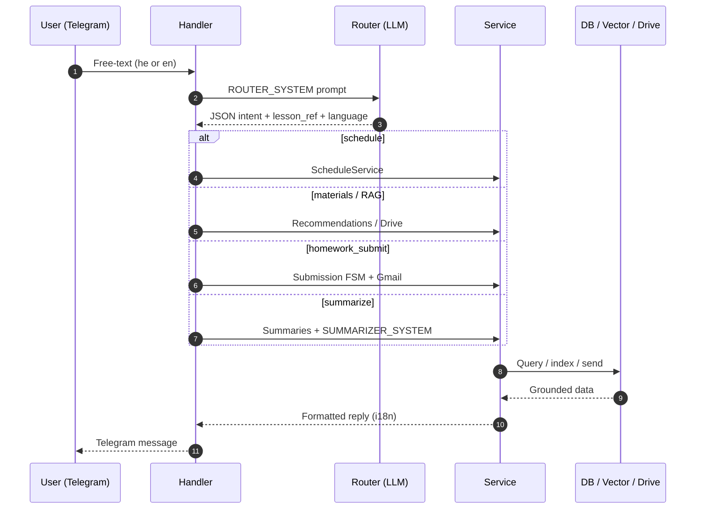

<div align="center">

# course-assistant-bot

### Bilingual Telegram course-ops assistant (HE / EN)

**Schedule · recordings · homework · RAG recommendations · admin flows · strict typing · 224 tests**

[](https://github.com/reem-mor/course-assistant-bot/actions/workflows/ci.yml)
[](#technology-stack)
[](#technology-stack)
[](#verification)
[](#license)

[Summary](#project-summary) · [Architecture](#architecture) · [Use cases](#use-cases) · [Flow](#end-to-end-flow) · [Tools](#tools--integrations) · [Prompts](#system-prompts) · [Screenshots](#see-it-working) · [Quick start](#quick-start) · [Docs](#documentation)

Built by [Re'em Mor](https://github.com/reem-mor) · [AI Engineering Portfolio](https://github.com/reem-mor/ai-engineering-portfolio)

</div>

---

## Project summary

Production-grade **async Python 3.12** Telegram bot for the **Oz VeRuach** (עוז ורוח) AI-Augmented Software Engineering cohort — schedule, materials, homework submission, lesson summaries, and RAG-powered recommendations.

> **Core principle:** deterministic routing + typed services — **the LLM classifies and summarizes; business rules stay in code.**  
> All external APIs (Telegram, Drive, LLMs, Gmail) are **mocked in tests** — CI never hits the network.

| Property | Detail |
|----------|--------|
| **Runtime** | Single-process default (`RUN_SCHEDULER_IN_BOT=true`) — bot + scheduler in one loop |
| **Package mgmt** | [uv](https://docs.astral.sh/uv/) + `pyproject.toml` / lockfile |
| **Quality** | ruff · mypy (strict) · pytest · GitHub Actions |
| **Status** | Feature-complete Phases 0–7 — see [`PLAN.md`](PLAN.md) |

---

## Architecture

Colour-coded by layer — **Telegram → handlers → LangGraph router → services → data & external APIs**:

<details open>
<summary><b>Interactive system diagram</b> — mermaid (renders on GitHub)</summary>



</details>

| Layer | Component | Role |
|-------|-----------|------|
| 🔵 **Telegram** | PTB v21 async handlers | Commands, free-text, admin FSM flows |
| 🟣 **Router** | LangGraph + LLM JSON | Intent: schedule, homework, materials, admin… |
| 🟠 **Services** | Typed service layer | Drive, schedule scrape, submission email, RAG |
| 🟢 **Persistence** | SQLAlchemy + Alembic | Users, submissions, admin list, vectors |
| 🟢 **Workers** | APScheduler (in-bot or split) | Drive watcher, schedule refresh, precompute |
| 🩷 **Observability** | structlog + `/healthz` | JSON logs with secret redaction |

Deep dive: [`docs/architecture.md`](docs/architecture.md)

---

## Use cases

| # | Actor | Scenario | Flow |
|---|-------|----------|------|
| 1 | Student | "What's on the schedule this week?" (HE/EN) | Router → schedule service → YAML/DB |
| 2 | Student | Ask for recordings / materials for lesson N | Drive index + lesson_map |
| 3 | Student | Free-text homework question | Homework service + optional RAG |
| 4 | Student | Submit homework attachment | FSM → Gmail to instructors (env recipients) |
| 5 | Student | "Summarize last lesson" | Drive fetch → LLM summarizer prompt |
| 6 | Student | "Recommend resources for RAG topic" | Embeddings + vector search |
| 7 | Admin | `/announce` or upload file to broadcast | Notifier → subscribed chat IDs |
| 8 | Owner | `/reindex` `/refresh_schedule` `/admin add` | Privileged maintenance commands |

Role matrix: `OWNER_TELEGRAM_IDS` · `ADMIN_TELEGRAM_IDS` · everyone else = student.

---

## End-to-end flow

<details>
<summary><b>Sequence diagram</b> — free-text message → intent → service → reply</summary>



</details>

---

## Tools & integrations

| Integration | Used for | Config |
|-------------|----------|--------|
| **Telegram Bot API** | All user interaction | `TELEGRAM_BOT_TOKEN` |
| **Google Drive** | Materials, recordings, admin upload | OAuth or service account |
| **Gmail API** | Homework submission email | OAuth refresh token |
| **Anthropic / OpenAI / Google** | Router, summaries, embeddings | At least one API key |
| **Postgres + pgvector** | Production vectors + ORM | `DATABASE_URL` / Supabase |
| **SQLite** | Local dev zero-config | Default in dev |
| **ffmpeg** | Transcription (optional) | System package |

### CLI entry points

| Command | Role |
|---------|------|
| `uv run oz-bot` | Telegram bot (long-polling or webhook) |
| `uv run oz-worker` | Separate worker (if `RUN_SCHEDULER_IN_BOT=false`) |
| `uv run alembic upgrade head` | Apply DB migrations |

### HTTP ops endpoints

| Path | Purpose |
|------|---------|
| `/healthz` | Liveness (bot :8080, worker :8081) |
| `/metrics` | Basic Prometheus-style counters |

---

## System prompts

Versioned in [`app/graph/prompts.py`](app/graph/prompts.py) (`PROMPT_VERSION = "2026-06-18"`).

| Prompt | Role |
|--------|------|
| `ROUTER_SYSTEM` | JSON-only intent classifier (schedule, homework, materials, …) |
| `SUMMARIZER_SYSTEM` | Lesson summary from slides/transcript — no invented content |

<details>
<summary><b>Router prompt (excerpt)</b></summary>

```
You are the routing brain of the official assistant for the "Oz VeRuach" software-engineering course.
Given a user message (Hebrew or English), output a single JSON object:
{"intent": one of [schedule, summarize, materials, homework_latest, homework_submit,
 recording, admin_upload, smalltalk, unknown], "lesson_ref": string|null,
 "scope": one of [next, this_week, full, last, specific, all]|null,
 "language": "he"|"en"}.
Output JSON only, no prose.
```

</details>

<details>
<summary><b>Summarizer prompt (excerpt)</b></summary>

```
Summarize the provided lesson material for a student who may have missed the lesson.
Reply in the user's language ({language}). Produce: 2-3 sentence overview, 4-8 bullet key points,
"What to review", and homework mentioned. Be accurate; do not invent content not in the source.
```

</details>

---

## See it working

Telegram UI runs on your phone/desktop — no web dashboard. Evidence in this repo:

| Artifact | Where |
|----------|-------|
| **Architecture** | Mermaid diagrams above (renders on GitHub) |
| **Test suite** | `uv run pytest -q` → 224 passed, all APIs mocked |
| **CI badge** | [GitHub Actions](https://github.com/reem-mor/course-assistant-bot/actions) |
| **Phase gates** | [`PLAN.md`](PLAN.md) — acceptance checklists per phase |

<details>
<summary><b>Example operator session (text)</b></summary>

```
Student: מה יש השבוע בלוז?
Bot:     📅 Week 12 — Wed 09:00 Microsoft Copilot ecosystem (Alex) …

Student: /help
Bot:     Menu with schedule · recordings · homework · recommendations

Owner:   /reindex
Bot:     Rebuilding vector index from Drive… done (N chunks).
```

</details>

---

## Technology stack

| Area | Technology |
|------|------------|
| Language | Python 3.12, async/await throughout |
| Bot framework | python-telegram-bot 21.x |
| Config | pydantic-settings v2, `SecretStr` |
| ORM | SQLAlchemy 2 async + Alembic |
| LLM | Anthropic, OpenAI, Google GenAI (pluggable) |
| RAG | Embeddings + pgvector / local vectorstore |
| Jobs | APScheduler (drive watcher, schedule refresh) |
| Tooling | uv, ruff, mypy strict, pytest-asyncio |

---

## Quick start

```bash
git clone https://github.com/reem-mor/course-assistant-bot.git
cd course-assistant-bot
cp .env.example .env          # TELEGRAM_BOT_TOKEN required
uv sync --extra dev
uv run oz-bot
```

<details>
<summary><b>Docker · worker · venv fallback</b></summary>

```bash
docker compose up --build
uv run oz-worker                    # optional second process
python3.12 -m venv .venv && pip install -e ".[dev]"
```

</details>

---

## Verification

```bash
uv run pytest -q
uv run ruff check .
uv run mypy app
curl http://localhost:8080/healthz
```

CI runs ruff + mypy + pytest on every push.

---

## Documentation

| Doc | Contents |
|-----|----------|
| [`PLAN.md`](PLAN.md) | Phase 0–7 build plan + acceptance gates |
| [`docs/architecture.md`](docs/architecture.md) | Component diagram + package map |
| [`.env.example`](.env.example) | Full credential contract |
| [`AGENTS.md`](AGENTS.md) | Agent/dev guidance |

---

## License

MIT — see project license file.
