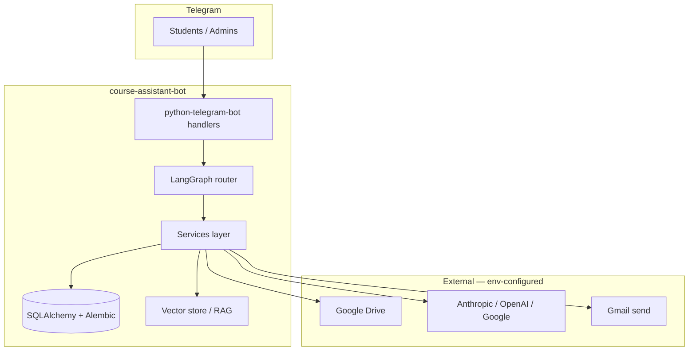

# course-assistant-bot

**Production-grade Telegram assistant** for a bilingual (HE/EN) AI engineering cohort — schedule, recordings, homework, RAG recommendations, and admin ops.

Built by [Re'em Mor](https://github.com/reem-mor) · AI Engineer × SRE · [Learning archive](https://github.com/reem-mor/ai-engineering-portfolio)

<p align="center">
  <a href="#quick-start">Quick start</a> ·
  <a href="#architecture">Architecture</a> ·
  <a href="#commands">Commands</a> ·
  <a href="#configuration">Config</a> ·
  <a href="#testing">Tests</a>
</p>

<p align="center">
  <a href="https://github.com/reem-mor/course-assistant-bot/actions/workflows/ci.yml"></a>
  
  
  
  
  
</p>

## At a glance

| | |
|---|---|
| **Runtime** | Async Python 3.12 · [uv](https://docs.astral.sh/uv/) · strict mypy + ruff |
| **Integrations** | Telegram · Google Drive · multi-LLM · Gmail · Postgres/pgvector |
| **Ops** | Alembic migrations · structured logging · health/metrics endpoints |
| **Tests** | 224 pytest cases — **all external APIs mocked**, no live network in CI |

Single-process default: bot + scheduler in one event loop (`RUN_SCHEDULER_IN_BOT=true`).

---

## Quick start

```bash
git clone https://github.com/reem-mor/course-assistant-bot.git
cd course-assistant-bot
cp .env.example .env    # set TELEGRAM_BOT_TOKEN at minimum
uv sync --extra dev
uv run oz-bot
```

Health: `curl http://localhost:8080/healthz`

<details>
<summary><strong>Docker · worker split · venv fallback</strong></summary>

**Docker**

```bash
cp .env.example .env && docker compose up --build
```

**Separate worker** (optional)

```bash
uv run oz-worker    # second terminal; set RUN_SCHEDULER_IN_BOT=false on bot
```

**Without uv**

```bash
python3.12 -m venv .venv && source .venv/bin/activate
pip install -e ".[dev]"
python -m app.main_bot
```

</details>

---

## Architecture



| Package | Role |
|---------|------|
| `app/bot/` | Handlers, admin flows, submission UX |
| `app/services/` | Drive, schedule, homework, RAG, email |
| `app/graph/` | Intent routing and LLM orchestration |
| `app/workers/` | Drive watcher, schedule refresh, precompute |
| `app/core/` | Settings (pydantic v2), i18n, ratelimit, metrics |

Layout details: see [Project layout](#project-layout) below.

---

## Commands

| Audience | Examples |
|----------|----------|
| **Everyone** | `/start` `/menu` `/help` `/myid` + free-text (schedule, recordings, homework, recommendations) |
| **Admins** | `/announce` `/schedule_update` · file upload to broadcast |
| **Owner** | `/map` `/reindex` `/refresh_schedule` `/admin add\|remove\|list` |

Roles are gated by `OWNER_TELEGRAM_IDS` and `ADMIN_TELEGRAM_IDS` in `.env`.

---

## Configuration

All secrets via environment variables — see [`.env.example`](.env.example).

| Variable | Required when |
|----------|----------------|
| `TELEGRAM_BOT_TOKEN` | Always |
| `GOOGLE_OAUTH_*` or `GOOGLE_SA_JSON` | Drive / Gmail features |
| `ANTHROPIC_API_KEY` / `OPENAI_API_KEY` / `GOOGLE_API_KEY` | LLM + embeddings |
| `DATABASE_URL` / `SUPABASE_DB_URL` | Production Postgres |
| `WEBHOOK_URL` | Webhook mode (prod) |

Phase breakdown and roadmap: [`PLAN.md`](PLAN.md)

---

## Testing

```bash
uv sync --extra dev
uv run pytest -q
uv run ruff check .
uv run mypy app
```

CI: ruff · mypy · pytest on every push.

---

## Project layout

```text
course-assistant-bot/
  app/bot/          # Telegram handlers
  app/services/     # Drive, schedule, RAG, email, …
  app/graph/        # LangGraph router
  app/workers/      # Scheduled jobs
  app/core/         # settings, logging, health
  data/             # YAML catalogs + local SQLite dev
  migrations/       # Alembic
  tests/            # unit + integration (mocked)
```

---

## Deploy (EC2 / systemd)

```bash
uv sync --extra auth
uv run alembic upgrade head   # if using Postgres
```

Example systemd unit:

```ini
[Service]
WorkingDirectory=/home/ubuntu/course-assistant-bot
ExecStart=/home/ubuntu/.local/bin/uv run oz-bot
EnvironmentFile=/home/ubuntu/course-assistant-bot/.env
Restart=always
```

Webhook mode: set `RUN_MODE=webhook` and `WEBHOOK_URL` (HTTPS).

---

## License

MIT — see [`LICENSE`](LICENSE) if present, else project root license from extraction.
